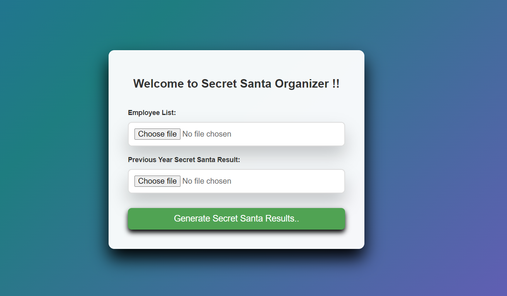
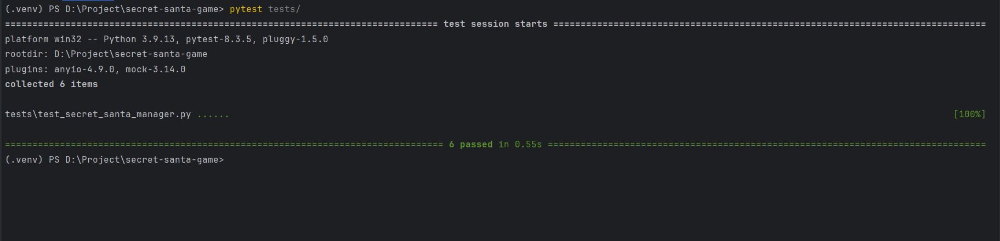

# 🎅 Secret Santa Game - Project Documentation

## 📢 Overview
The **Secret Santa Game** is a web-based application that automates the process of assigning Secret Santa pairs while ensuring that no one is assigned their previous year's recipient.


##### The system allows employees to:

✅ Upload a CSV file with employee details  
✅ Upload the previous year's results  
✅ Generate and download a new CSV file with updated assignments

---

## 🚀 Technologies Used
This project is built using the following technologies:

| **Technology**                 | **Purpose**  |
|--------------------------------|-------------|
| **Python (FastAPI)**           | Backend framework for handling file uploads and generating assignments |
| **HTML, CSS, JavaScript**      | Frontend UI for interacting with the user |
| **Pandas**                     | CSV processing and data validation |
| **Pytest**                     | Unit testing for code reliability |
| **Random Library**             | Shuffling logic to assign Secret Santa |
| **FastAPI StaticFiles**        | Serving frontend assets (CSS, JS) |
| **Uvicorn**                    | Running the FastAPI server |

---

## 📂 Project Structure
```
secret-santa-game/
│── src/
│   └── secret_santa_manager.py  # Core logic for Secret Santa
│── static/
│   ├── style.css  # UI Styling
│   ├── script.js  # Frontend logic
│   └── index.html  # Main UI page
│── tests/
│   ├── test_secret_santa_manager.py  # Test cases
│── main.py  # FastAPI application entry point
│── requirements.txt  # Dependencies
│── README.md  # Project Documentation
```

---

## 🔗 API Details
### 1️⃣ Upload Employee CSV Files
- **Endpoint:** `POST /upload/employee_list`
- **Description:** Accepts CSV files for the current year's employees and last year's Secret Santa results.
- **Request Body:** `multipart/form-data`
- **Parameters:**
    - `Employee-List.csv`
    - `Secret-Santa-Game-Result.csv`
- **Response:** Returns the new **Secret Santa assignments as a CSV file**.

---

## 💻 UI Details
The UI is **simple and user-friendly**, allowing users to:
✅ Upload the **employee list** & previous year’s results  
✅ Click the **"Generate Secret Santa Results"** button  
✅ Download the generated CSV file

---

## 📊 Testing (Pytest)
To ensure code reliability, we implemented **unit tests** for:  
✅ **CSV Processing**  
✅ **Secret Santa Assignment Logic**  
✅ **CSV Generation**



Run the tests using:
```bash
   pytest tests/
```

---

## 📖 How to Setup and Run the Project
### **1️⃣ Clone the Repository**
```bash
  git clone https://github.com/NaveenJsDevops/secret-santa-game.git
  cd secret-santa-game
```

### **2️⃣ Install Dependencies**
```bash
  pip install -r requirements.txt
```

### **3️⃣ Run the FastAPI Server**
```bash
  uvicorn main:app --reload
```

### **4️⃣ Open the UI**
Go to:  **[_http://127.0.0.1:8000/_](http://127.0.0.1:8000/)**  in your browser.

---

## ✅ Conclusion
This project successfully automates the **Secret Santa** assignment process with a **user-friendly interface, backend validation, and robust testing**. 🎄✨

---

## 🔥 Future Enhancements
- 📧 **Email Integration:** Send Secret Santa assignments directly to employees
- 📊 **Analytics Dashboard:** Track participation trends
- 🖥️ **Admin Panel:** Manage employee lists via UI

---

### Made with ❤️ by _Naveen Kumar_ 🚀
